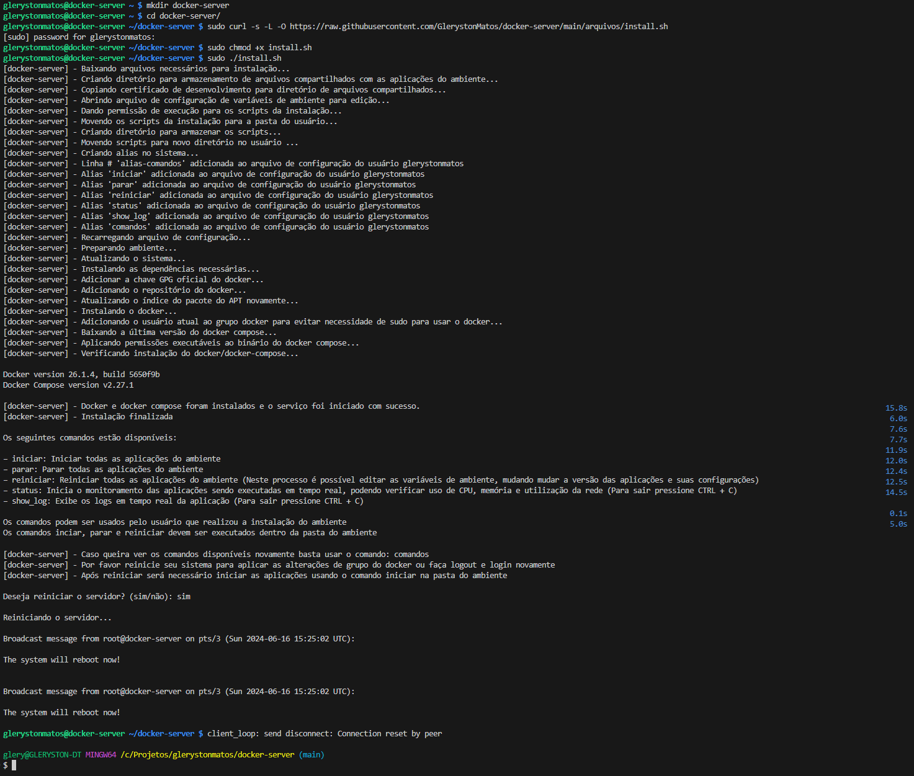

# Conectar no servidor a partir de outra máquina usando SSH (Caso o acesso seja realizado diretamente no servidor este passo não é necessário)

Conectar no servidor via SSH (usuario:ip)<br>
Após executar o comando será solicitada a senha do usuário informado:<br><br>
<b>Observação:</b> Caso não saiba o IP do servidor verificar o próximo tópico

```bash
ssh glerystonmatos@10.0.0.195
```


Para sair do acesso deve ser usado o comando exit:


# Verificar IP do servidor

Instalar ferramentas de rede:
```bash
sudo apt install net-tools
```

Verificar IP do servidor:
```bash
ifconfig
```


# Instalação do ambiente

Criar pasta para armazenar arquivos (Criar na raiz do usuário, neste exemplo: glerystonmatos/docker-server):
```bash
mkdir docker-server
```

Entrar na pasta de armazenamento dos arquivos da instalação:
```bash
cd docker-server/
```

Baixar arquivo de instalação do ambiente:
```bash
sudo curl -s -L -O https://raw.githubusercontent.com/GlerystonMatos/docker-server/main/arquivos/install.sh
```

Dar permissão de execução para o script de instalação do ambiente:
```bash
sudo chmod +x install.sh
```

Executar script de instalação do ambiente:
```bash
sudo ./install.sh
```

Processo de instalação sendo realizado:<br><br>
<b>Observação:</b> No final do processo será dada a opção de reiniciar o servidor (Recomento reiniciar), caso não seja possível realize logout e login no servidor



Durante o processo de instalação o arquivo de configuração será aberto, possibilitando editar as configurações das aplicações do ambiente, os paços para operar o arquivo serão exibidos na primeira linha e no final do console:


# Personalizar o prompt do shell (Opcional - Melhoria apenas visual da exibição das informações do console do servidor)

Abrir arquivo de configuração do usuário (glerystonmatos/.bashrc):
```bash
nano ~/.bashrc
```

Para personalizar o shell deve ser alterado o valor da variável PS1 (Localizar no arquivo):
```bash
PS1='\[\e[1;32m\]\u@\h \[\e[1;34m\]\w \$\[\e[0m\] '
```

Esta configuração exibe o nome do usuário em verde, o nome do host em azul e o diretório de trabalho atual em azul

- \[\e[1;32m\] define a cor verde.
- \u é substituído pelo nome do usuário.
- \h é substituído pelo nome do host.
- \[\e[1;34m\] define a cor azul.
- \w é substituído pelo diretório de trabalho atual.
- \[\e[0m\] redefine todas as cores ao padrão.

Após editar as variáveis de ambiente o comando a seguir deve ser usado para recarregar o arquivo de configuração do usuário (glerystonmatos/.bashrc):
```bash
source ~/.bashrc
```

Pode ser necessário reiniciar o servidor para as configurações surtirem efeito

